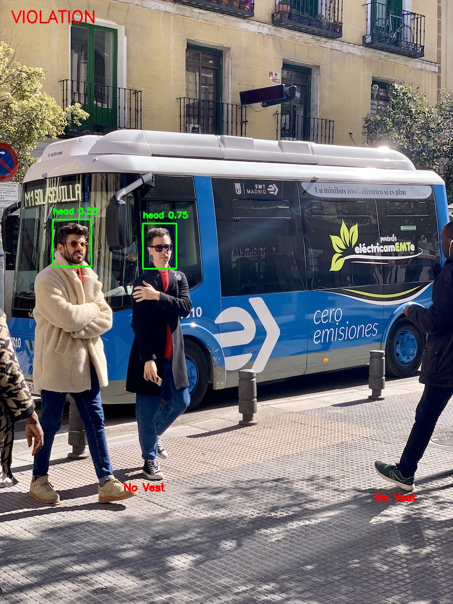

# 🏭 Smart Factory PPE Detection System

A Personal Protective Equipment (PPE) detection system built using **YOLOv8**. The project detects workplace safety violations from images, videos, and live webcam feeds by identifying whether workers are wearing required safety equipment such as helmets and safety vests.

🔗 Repository: https://github.com/siddanthgaikwad/Smart-Factory-Personal-Protective-Equipment-PPE-Detection-System

---

## 📌 Overview

Workplace safety is a critical part of industrial operations. This project uses computer vision and deep learning to automatically detect PPE compliance and highlight safety violations in real time.

The system supports:

* 🖼️ Image-based detection
* 🎥 Video analysis
* 📷 Live webcam monitoring
* 📝 Violation logging
* 📊 Streamlit dashboard
* 📈 Prometheus monitoring
* 🐳 Docker deployment
* ☸️ Kubernetes deployment

---

## ✨ Features

### 🔍 PPE Detection

* Detects workers using YOLOv8
* Identifies missing safety equipment
* Highlights PPE violations in real time
* Generates annotated output images and videos

### 🎥 Multiple Input Sources

* Image files
* Video files
* Live webcam feed

### 📊 Dashboard Support

* Upload images through Streamlit
* View detection results instantly
* Simple and interactive user interface

### 📈 Monitoring

* Violation logging
* Prometheus metrics endpoint
* Grafana integration support

### 🐳 Deployment Ready

* Dockerized application
* Kubernetes manifests included

---

## 📸 Detection Result



Example output showing worker detection and PPE violation identification.

---

## 🛠️ Tech Stack

| Component        | Technology           |
| ---------------- | -------------------- |
| Object Detection | YOLOv8 (Ultralytics) |
| Language         | Python               |
| Computer Vision  | OpenCV               |
| Dashboard        | Streamlit            |
| Monitoring       | Prometheus           |
| Visualization    | Grafana              |
| Containerization | Docker               |
| Orchestration    | Kubernetes           |

---

## 📂 Project Structure

```text
smart_factory_ppe/
│
├── app/
│   ├── __init__.py
│   └── dashboard.py
│
├── configs/
├── data/
├── logs/
│   └── log.csv
│
├── models/
│
├── outputs/
│   ├── images/
│   ├── reports/
│   └── videos/
│
├── runs/
│
├── sample_data/
│   ├── images/
│   └── videos/
│
├── screenshots/
│
├── utils/
│   ├── __init__.py
│   ├── detection.py
│   ├── logger.py
│   └── utils.py
│
├── .dockerignore
├── .gitignore
├── best.pt
├── yolov8n.pt
├── train.py
├── main.py
├── requirements.txt
├── Dockerfile
├── deployment.yaml
├── service.yaml
├── metrics-service.yaml
├── prometheus.yaml
├── grafana.yaml
└── README.md
```

---

## ⚙️ Installation

### Clone Repository

```bash
git clone https://github.com/siddanthgaikwad/Smart-Factory-Personal-Protective-Equipment-PPE-Detection-System.git

cd Smart-Factory-Personal-Protective-Equipment-PPE-Detection-System
```

### Create Virtual Environment

```bash
python -m venv .venv
```

#### Linux / macOS

```bash
source .venv/bin/activate
```

#### Windows

```bash
.venv\Scripts\activate
```

### Install Dependencies

```bash
pip install -r requirements.txt
```

---

## 🚀 Running the Project

### Image Detection

```bash
python main.py --mode image --input sample_data/images
```

Output images are saved in:

```text
outputs/images/
```

### Video Detection

```bash
python main.py --mode video --input sample_data/videos/your_video.mp4
```

### Webcam Detection

```bash
python main.py --mode webcam
```

Press **Q** to exit the webcam window.

---

## 🌐 Streamlit Dashboard

Run the dashboard:

```bash
streamlit run app/dashboard.py
```

Default URL:

```text
http://localhost:8501
```

The dashboard allows users to upload images and check PPE compliance through a simple web interface.

---

## 📊 Prometheus Metrics

Metrics are exposed on:

```text
http://localhost:8000
```

These metrics can be scraped by Prometheus and visualized using Grafana dashboards.

---

## 🐳 Docker Deployment

Build Docker image:

```bash
docker build -t smart-factory-ppe .
```

Run container:

```bash
docker run -p 8501:8501 -p 8000:8000 smart-factory-ppe
```

---

## ☸️ Kubernetes Deployment

Deploy the application:

```bash
kubectl apply -f deployment.yaml
kubectl apply -f service.yaml
```

Verify deployment:

```bash
kubectl get pods
kubectl get services
```

---

## 🎯 Use Cases

* Smart Factories
* Manufacturing Plants
* Construction Sites
* Industrial Safety Monitoring
* Compliance Auditing
* Workplace Safety Automation

---

## 👨‍💻 Author

**Gaikwad Siddanth**

GitHub: https://github.com/siddanthgaikwad

---

## 📄 License

You are free to use, modify, and distribute this project for educational and learning purposes.